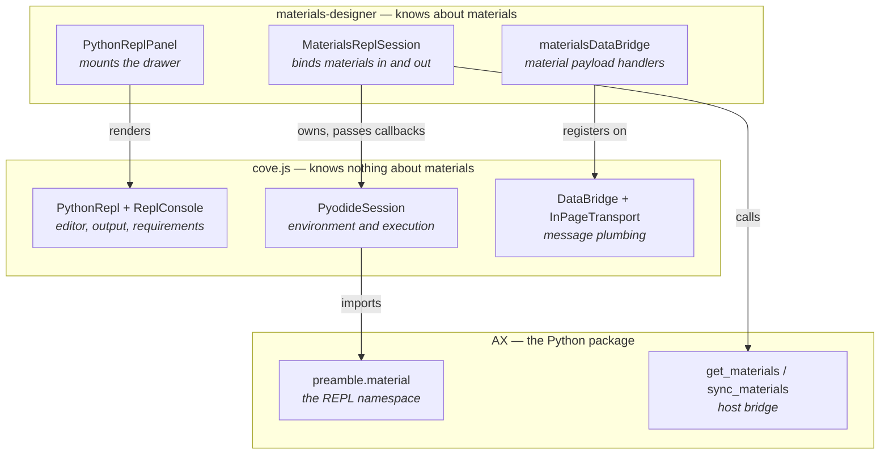
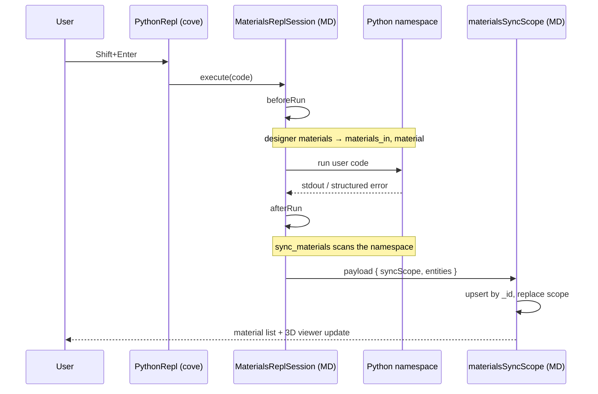

# Python REPL architecture

The **View → Python REPL** panel runs Python in the browser, against the materials currently open in
the designer. You type `create_supercell(...)`, press Shift+Enter, and the resulting material appears
in the material list and the 3D viewer.

This document explains how that works. For how to *run* or *configure* it, see README section 3.7.

## 1. The one-sentence version

A single Python interpreter lives in the page; before each run the designer's materials are pushed
into its namespace, and after each run any new `Material` in that namespace is pulled back out.

## 2. Three layers

Everything reusable lives in **cove.js**, everything material-specific in **materials-designer**, and
the Python in **AX** (`mat3ra-notebooks-utils`). Nothing material-aware exists in cove.

Materials Designer authors no Python *modules*. The handful of inline Python lines in
`MaterialsReplSession` are bootstrap glue — they import the AX preamble and call AX functions.
Anything more than that belongs in AX.



Read each column top-to-bottom as "a specific thing standing on a generic thing".
`PythonReplPanel` only mounts cove's REPL and feeds it props. `MaterialsReplSession` *owns* a
`PyodideSession` and hands it three callbacks — build the namespace, bind materials in, sync them
out. `materialsDataBridge` registers material handlers on cove's entity-agnostic `DataBridge`.

Nothing here subclasses anything in cove. The whole contract is one constructor call, which is also
the fastest way to see what the REPL does:

```ts
this.session = new PyodideSession({
    ...packageSpec,
    setupNamespace: (pyodide, log) => this.setUpMaterialNamespace(pyodide, log),
    beforeRun: (pyodide) => this.bindHostMaterials(pyodide),
    afterRun: (pyodide) => this.syncNamespaceToHost(pyodide),
});
```

`afterRun` deliberately fires for failed runs too — code that raised halfway may still have produced
materials worth syncing.

## 3. The classes, and why each one exists

| Class | Repo | Why it exists |
|---|---|---|
| `PyodideSession` | cove | Owns the interpreter: builds the environment, runs code in a persistent namespace, resolves completions. Knows nothing about materials. |
| `MaterialsReplSession` | MD | Owns the above and supplies its three callbacks: install the AX profile and import the preamble, bind materials in, sync them out. Implements the same `PythonSessionInterface` the UI consumes. That is its whole job. |
| `PythonRepl` / `ReplConsole` | cove | Editor, output pane, error rendering, requirements tab. Takes a session as a prop and calls `execute`. |
| `PythonReplPanel` | MD | Mounts `PythonRepl` in a drawer, fetches the environment manifest, wires the session to designer state. |
| `DataBridge` / `InPageTransport` | cove | A handler registry plus the in-page transport. The same bridge serves the iframe notebooks. |
| `materialsDataBridge` | MD | The two material handlers: "give me the materials" and "here are the results". |

There is exactly **one** Pyodide interpreter per page, and `PyodideSession` enforces that with an
ownership claim — a second instance throws rather than silently sharing globals.

## 4. What happens on one run



Both directions travel over the bridge; Python never touches React state directly.

- **In:** `beforeRun` fires `Action.getData`, whose handler returns `materials.map(m => m.toJSON())`.
  AX's `get_materials` turns that into `materials_in`, and `material` is the selected one.
- **Out:** `afterRun` calls AX's `sync_materials`, which walks the namespace for public `Material`
  bindings and hands a payload to `window.sendDataToHost`.

## 5. The one rule worth knowing: `syncScope`

Re-running a cell must not pile up duplicates, but it also must not clobber materials you authored by
hand. So the sync payload carries a `syncScope`, and the reducer treats it as a region it owns:

- Materials that round-tripped (they have an `_id`) are **upserted in place**.
- Materials the REPL created (no `_id`) are tagged with the scope and **replace the previous batch**.
- Everything outside the scope is untouched.

`syncScope` lives on `MDMaterial` but is deliberately **absent from `toJSON`** — it is a runtime marker,
never part of the ESSE wire format, and never exported.

## 6. Where the Python environment comes from

The REPL installs the same package set as the production JupyterLite kernel: AX's `config.yml`, its
`made` profile, and prebuilt pure-Python wheels for the packages that cannot build under Pyodide
(`pymatgen`, `spglib`, `pydantic`). A build step caches those under `public/` so the browser fetches
them same-origin.

One temporary exception: the notebooks-utils wheel is pinned to a URL, because no released version
carries the host bridge yet. The constant in `src/components/repl/constants.ts` documents the removal
condition. README 3.7 has the full picture.

## 7. The environment spec

`PyodideEnvironmentSpec` is a bag of options because package installation is order-sensitive — that
order is the whole reason the fields are separate:

| Field | What it does |
|---|---|
| `indexUrl` | Where Pyodide itself loads from. Always passed explicitly; letting Pyodide guess breaks under Vite. |
| `loadPackages` | Pyodide's own built-ins, loaded first. |
| `pypiPinnedPackages` | Pinned PyPI deps, installed **with** dependencies. |
| `wheelFilenames` | Prebuilt wheels, installed **without** dependencies — they exist precisely because their transitive deps conflict or will not build. |
| `postWheelPackages` | Installed last, after the wheels are in place. |
| `wheelBaseUrl` | Where the wheels are served from; a host app can override it. |
| `setupNamespace` / `beforeRun` / `afterRun` | The caller's domain hooks, described above. |

## 8. Where to look

| Path | |
|---|---|
| `src/components/repl/` | The whole MD-side feature — 4 files |
| `src/reducers/Material.ts` | `materialsSyncScope`, the merge rule above |
| `scripts/provision-repl-wheels.mjs` | Build-time environment caching |
| `tests/cypress/e2e/repl/` | The feature spec — drives the panel against a real interpreter |
| cove `src/other/pyodide/`, `src/other/repl/` | The generic half |
